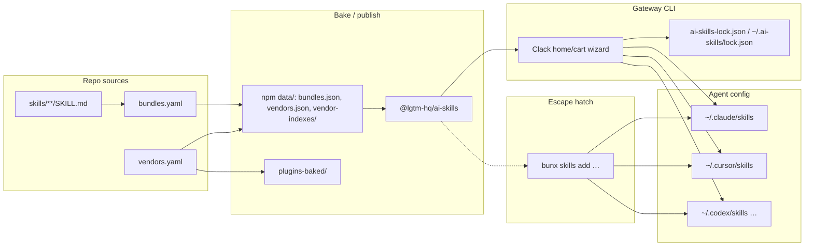

# Contributing to ai-skills

Thanks for helping improve this shared **Agent Skills** library.

## Organization-wide expectations

LGTM-HQ’s cross-repo contributor guidance lives in the
**[`.github` repository](https://github.com/lgtm-hq/.github)**. Read it alongside this
document:

- **[Contributing (org)](https://github.com/lgtm-hq/.github/blob/main/CONTRIBUTING.md)**
- **[Code of Conduct](./CODE_OF_CONDUCT.md)**

## What belongs in this repo

- **Skills:** each skill is `skills/<name>/SKILL.md` with YAML frontmatter (`name`,
  `description`, …) following the conventions used by existing skills.
- **Index:** after adding, renaming, or removing skills, **`AGENTS.md` must stay in
  sync**. CI runs `scripts/generate_agents_md.py` / validation; run the same checks
  locally before opening a PR (see below).
- **Plugins:** assign each skill to a plugin group in **`bundles.yaml`** (or
  list it under `ungrouped` until it joins a plugin). Each group needs a
  kebab-case **`id`** (the installable plugin name). Regenerate
  **`.claude-plugin/marketplace.json`** and
  **`.cursor-plugin/marketplace.json`** with
  `uv run python scripts/generate_marketplace.py`. Both files are generated
  adapters (do not edit by hand).
- **README plugin table:** the `## Plugins` table in `README.md` is generated
  from `bundles.yaml`. Release-tag / npm-version pins are generated from
  `pyproject.toml`. Regenerate with `uv run python scripts/generate_readme.py`.
- **Architecture decisions:** settled plugin-canonical *why* lives in
  [`docs/adr/`](docs/adr/README.md). Implementation PRs follow accepted ADRs;
  a superseding ADR is the way to change one.
- **No secrets:** do not add API keys, tokens, or environment-specific paths in skill
  bodies or examples.
- **No project-session context dumps:** one-off session notes for a single project do
  not belong in the catalog ([#55](https://github.com/lgtm-hq/ai-skills/issues/55)).

## Local development

```bash
git clone https://github.com/lgtm-hq/ai-skills.git
cd ai-skills
uv sync
uv run lintro fmt
uv run lintro chk
uv run lintro tst
bash scripts/validate.sh
```

Use **`uv`** for Python tooling and **`lintro`** for lint/format/check — do not bypass
with raw **ruff**, **black**, etc.

When you add or move skills, also run:

```bash
uv run python scripts/generate_agents_md.py
uv run python scripts/generate_marketplace.py
uv run python scripts/generate_readme.py
bash scripts/validate.sh
```

## Adding / updating a vendor

Third-party vendors live in root **`vendors.yaml`** (SHA-pinned). Use
`scripts/manage_vendors.py` to mutate the registry and regenerate every derived
artifact (baked `vendor-indexes/`, `plugins-baked/`, `NOTICE.md`, and the
embedded npm package data) in one step — never hand-edit the baked indexes or
plugin trees.

```bash
# Add a vendor (all fields required; --display-ref defaults to latest)
uv run python scripts/manage_vendors.py add \
  --id owner-skills --repo owner/skills \
  --sha 0123456789abcdef0123456789abcdef01234567 \
  --skill-roots skills --license MIT \
  --homepage https://github.com/owner/skills

# Update fields on an existing vendor (only --id is required)
uv run python scripts/manage_vendors.py update --id owner-skills \
  --sha 89abcdef0123456789abcdef0123456789abcdef

# Rebake indexes + plugin trees + resync npm data without touching vendors.yaml
# (this is the Renovate path for automated vendor SHA bumps)
uv run python scripts/manage_vendors.py refresh

# Verify baked indexes, plugin trees, and npm data are current (exits non-zero on drift)
uv run python scripts/manage_vendors.py check
```

`add`/`update` still leave two edits for a human: add or update the vendor bullet in
**`README.md`** and record the change under the Unreleased section of
**`CHANGELOG.md`**. The script prints this reminder and never edits those files.

### Vendor plugin slices

Each vendor may declare `plugins:` — reviewed bake slices, not runtime
improvisation ([ADR-0005](docs/adr/0005-collision-doctrine.md),
[ADR-0006](docs/adr/0006-vendor-bake-safety.md)). Omit the field or use
`plugins: []` until a slice is declared; `plugins: null` is rejected.
Filling the five registered vendors is a separate issue; this schema is
validated whenever `vendors.yaml` loads.

Per plugin:

- `id` — kebab-case plugin id, unique across vendors and first-party
  `bundles.yaml` group ids (skipped only when a sibling `bundles.yaml`
  is absent, as in isolated tests)
- `description` — non-empty single-line string
- `skillsRoot` — canonical relative POSIX path or glob (no whitespace,
  backslashes, `.` / `..` / empty components, not absolute)
- `skills` — `"*"` (every skill under `skillsRoot`) or a non-empty list of
  canonical paths relative to `skillsRoot` (no glob metacharacters; the
  list must not contain `"*"`)
- `extraSkills` — optional repo-relative canonical paths to ingest in
  addition (no globs; omit the key rather than `null`)
- `renameSkills` — optional `{old: new}` kebab-case map; targets are unique
  across **all** vendors. Collisions against first-party skill directory
  names are reported at bake/CI, not at schema load. Every
  collision rename is a reviewed registry edit, never a bake/install
  guess. Duplicate YAML keys are rejected.
- `agents` — optional non-empty list of kebab-case agent markdown
  component names (the stem of `agents/*.md` files to ingest). Omit the
  key rather than `null`. This is not a host-id allowlist.

```yaml
    plugins:
      - id: example-plugin
        description: Example vendor plugin.
        skillsRoot: skills
        skills: "*"
        extraSkills:
          - extras/bonus
        renameSkills:
          teach: teach-example
        agents:
          - comment-sicko
          - code-reviewer
```

`scripts/manage_vendors.py` round-trips `plugins` when refreshing SHAs. Do
not hand-edit baked indexes or `plugins-baked/` to encode a slice.

### Vendor plugin bake

`scripts/bake_vendor_plugins.py` turns declared slices into canonical
plugin trees under **`plugins-baked/`** ([ADR-0006](docs/adr/0006-vendor-bake-safety.md)):

- Ingest exactly the registry slice (`skillsRoot` + `"*"` or paths,
  `extraSkills`, `agents` from `{repo}/agents/<stem>.md`).
- Apply `renameSkills` to the skill directory **and** the SKILL.md
  frontmatter `name:`. After copy (and any rename), frontmatter `name`
  must equal the skill directory name — that name is the explode
  identity used for collision checks.
- Reject symlinks, path escapes, and missing `SKILL.md`. Walk the
  entire vendor tree (including `node_modules` and `.git`) so hidden
  skills and symlinks cannot skip coverage or validation. Never execute
  vendor content.
- Write coverage (`plugins-baked/COVERAGE.md`: every un-ingested
  `SKILL.md` listed as `SKIPPED`) and fail CI on unresolved explode-name
  or agent-stem collisions against other baked plugins or first-party
  `skills/` names.
- Stage the complete tree in a temp directory and publish it with an
  atomic directory exchange so `plugins-baked/` is never absent or mixed,
  then mirror onto the original destination inode so resident shells keep
  a valid cwd. A leftover `.plugins-baked.bak` from a crashed older bake
  fails closed.
- Write `plugins-baked/BAKE.json` (registry pin including repo + plugin
  slice + coverage renderer inputs + a path→digest inventory).
  `--check` allowlists lock keys, re-derives ingested counts / explode
  names / collisions from the baked tree, re-renders `COVERAGE.md`,
  compares the lock to `vendors.yaml` and the committed tree, and
  requires all four host manifests to match the pin-derived version.
  Skipped vendor-tree paths cannot be reconstructed without a fetch.
  Relative markdown links in baked plugin files must resolve to a file
  inside the plugin.
- Stamp plugin versions from `displayRef` when it is a `major.minor.patch`
  tag (optional `v` prefix and prerelease suffix); floating pins such as
  `latest` and non-tag prefixes such as `v1.2-not-a-version` use the
  short SHA.

```bash
uv run python scripts/bake_vendor_plugins.py
uv run python scripts/bake_vendor_plugins.py --check
```

Production `vendors.yaml` stays index-only until plugin slices are
filled; bake still emits an empty marketplace, coverage file, and
`BAKE.json` lock so `--check` has a drift gate. ``--check`` compares
that lock to `vendors.yaml` (SHA, displayRef, plugin slices) and
cross-checks coverage inputs against the baked tree. A path→digest
inventory in `BAKE.json` rejects extra, missing, or modified generated
files. Extra lock keys and a non-mapping `BAKE.json` fail closed.

## Pull requests

- Use **[Conventional Commits](https://www.conventionalcommits.org/)** in PR titles;
  this repository uses **squash merge**, and the merge title may drive automated
  **semver** releases.
- Follow **`.github/PULL_REQUEST_TEMPLATE.md`** when you open a PR.
- Expect CI to run **lintro** (via the published **py-lintro** container image) and
  **`bash scripts/validate.sh`**.

## Review mindset

Skills are consumed by multiple agents; prefer **clear descriptions**, stable naming,
and **minimal required context** in each `SKILL.md`.

## Agent portability and cross-skill references

Skills are installed into multiple agents (Claude Code, Cursor, Codex, …), so skill
bodies must not assume one agent's features or tool names.

- **Cross-skill references:** reference other skills by backticked name in portable
  phrasing — e.g. "follow the `lint` skill", "see the `stand-general` skill" — never
  slash form ("see `/lint`"). Slash invocation is a Claude Code concept; other agents
  read `/lint` as opaque text. The backticked name keeps references greppable.
- **User-typed invocations are the exception:** keep the `/name` form only when
  describing something the **user** types, e.g. usage examples like
  "`/branch 123` — branch from issue #123" or "when the user invokes `/commit`".
- **Agent-specific tool names:** do not name agent-specific tools
  (e.g. `AskUserQuestion`, sub-agent types) as requirements. Describe the capability
  instead ("ask the user to confirm — use a structured question tool if available").
- **Marking agent-specific behavior:** if a step truly depends on one agent's
  capability (e.g. background sub-agents), phrase it as capability-conditional
  ("if the agent supports X, …") and provide an inline fallback so other agents can
  still complete the skill. Cite a specific agent only as an example ("e.g. Claude
  Code's …"), never as the only path.

## Architecture



Native hosts install **plugins** (see README Install). The **gateway** package
`@lgtm-hq/ai-skills` (`sk` / `skill`) currently projects a plugin through
`--bundle`; install globally with `bun add -g @lgtm-hq/ai-skills`, or for a
pinned, install-free run use `bunx --package=@lgtm-hq/ai-skills@X.Y.Z sk`.
Its Clack home/cart UI still loads baked `data/bundles.json` and vendor indexes
shipped inside the npm package (produced from `bundles.yaml` / `vendors.yaml`
at publish time), writes a gateway lockfile, and installs into agent skill
directories. The [Vercel Labs `skills` CLI](https://github.com/vercel-labs/skills)
remains the escape hatch for direct catalog installs; first-party skill paths
stay flat (`skills/<name>/`).

## CI and releases

Pull requests and pushes to `main` run **lintro** (via the published **py-lintro**
container image), the pytest suite, skill-structure validation, and
`bash scripts/validate.sh`.

**Validate Lintro Version** compares `pyproject.toml`'s exact `lintro==`
pin to the version inside the pinned `ghcr.io/lgtm-hq/py-lintro` digest on
`ci.yml` / `validate-lintro-version.yml`. Those three must move together
(Renovate's `lintro` group tracks the PyPI pin and workflow digests; the check
is a required status). Do not bump the pin alone.

Version bumps and **CHANGELOG.md** updates flow through **`lgtm-hq/lgtm-ci`**
[reusable workflows](https://github.com/lgtm-hq/lgtm-ci), called from this repo
with **full SHA pins** on `uses:` (see `.github/workflows/release-version-pr.yml`
and `release-auto-tag.yml`).

Skill retirements and other deletions belong under **`### Removed`** in
`CHANGELOG.md` ([Keep a Changelog](https://keepachangelog.com/en/1.1.0/)), not
under Other Changes or Previously Unreleased.

### CHANGELOG entry format

Every bullet that references a PR merged to `main` must end with
`(#PR) (shortsha)` — for example:

```text
- **gateway**: add manage_vendors CLI for SHA-pinned vendors (#248) (12fd543)
```

`shortsha` is the first 7 characters of the squash-merge commit on `main`.
Resolve it with:

```bash
git log --oneline | grep '(#248)'
# → 12fd543 feat(gateway): add manage_vendors CLI for SHA-pinned vendors (#248)
```

The `lgtm-hq/lgtm-ci` release-version-pr workflow appends this pair
automatically for generated entries. Human-authored bullets — for example when
recording a vendor addition or a manual CHANGELOG update — must follow the same
convention.

Entries that reference draft or abandoned PRs that were never merged to `main`
have no resolvable commit SHA; leave them without the shortsha suffix rather than
inventing one.

**Baseline note:** Caller pins are mostly
`768a6b72f0a5346b5ecba3f4e13b90040472341c` (**v0.52.4**). Link Check alone pins
`c4192f9d97fa79767241d85d0d8e4cba866dcdec` (post-v0.52.3 lychee-action output
fix; re-verify when bumping).

When a release is published, `.github/workflows/release-manifest.yml` runs
`scripts/generate_skills_manifest.py` to build **`skills-manifest.json`** (skill
name → sha256 of its `SKILL.md`), attests it with GitHub build provenance, and
attaches it to the GitHub Release. The manifest is generated **at release time
only** — it is not committed, so skill edits do not churn a checked-in file. CI
(`scripts/validate.sh`) verifies the generator is deterministic.

## Publishing `@lgtm-hq/ai-skills` (npm)

The gateway package lives in `npm/ai-skills/` (version `0.0.0-dev` on `main`).
Release tags use `vX.Y.Z`; the package version injects `X.Y.Z` to match.
Publishing uses **npm trusted publishing (OIDC)** via
`.github/workflows/publish-npm.yml` and the GitHub **`npm` environment**
(maintainer approval), mirroring
[py-lintro](https://github.com/lgtm-hq/py-lintro).

Before the first live publish:

1. Configure a trusted publisher on npmjs for `@lgtm-hq/ai-skills` pointing at
   this repository and workflow.
2. Ensure the GitHub Environment named `npm` exists with required reviewers.
3. Dry-run with `workflow_dispatch` using `release_tag: vX.Y.Z` and
   `dry_run: true` until the tarball looks right; then allow a real release
   publish.

The publish job syncs embedded `vendors.yaml`, baked indexes, and `NOTICE.md`
into the package before `npm publish`.

## Skill content policy

Skills are executable influence: every `SKILL.md` becomes instructions inside a
consumer's agent. Contributions are reviewed against this policy, and reviewers
(human or AI) should treat violations as blocking.

Skills **must not** instruct agents to:

- **Exfiltrate data** — send file contents, credentials, environment variables,
  or conversation context to external endpoints, or encode them into URLs,
  commit messages, or other side channels.
- **Weaken safety checks** — disable permission prompts, bypass sandboxes,
  suppress confirmation flows, edit agent configuration/policy files, or tell
  the agent to ignore other instructions.
- **Run unguarded destructive commands** — `rm -rf`, `git push --force`,
  `git reset --hard`, mass file rewrites, or anything irreversible without the
  gates below.

Destructive operations, where genuinely needed, **require both**:

- **A confirmation gate** — the skill must have the agent present exactly what
  will be destroyed and wait for explicit user confirmation before executing.
- **Path-safety checks** — resolve paths to canonical form and verify they are
  non-empty, exist, are not `/` or the home directory, sit under an expected
  prefix, and are not symlinks escaping that prefix.

The reference pattern is **`skills/reconcile`** (Phase 5 — Execute): it prefers
the safe tool (`git worktree remove`), gates the `rm -rf` fallback behind
explicit user confirmation, and runs the path-safety checklist above before any
delete. New skills with destructive steps should copy that structure.

Additional requirements:

- **No secrets** in skill bodies or examples (also listed above); never
  instruct agents to read or transmit credential files.
- **Network calls** must be limited to what the skill's stated purpose needs,
  target named first-party endpoints (no attacker-controllable URLs built from
  repo or conversation content), and never carry local data beyond what the
  user asked to publish.
- **Prefer reversible operations** and the least-privileged command that does
  the job.
