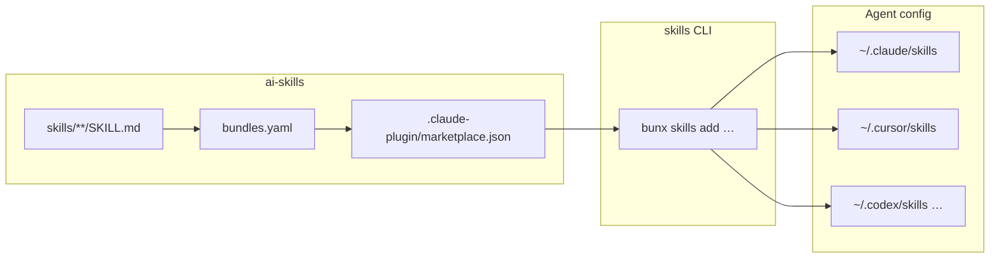

# Contributing to ai-skills

Thanks for helping improve this shared **Agent Skills** library.

## Organization-wide expectations

LGTM-HQ’s cross-repo contributor guidance lives in the
**[`.github` repository](https://github.com/lgtm-hq/.github)**. Read it alongside this
document:

- **[Contributing (org)](https://github.com/lgtm-hq/.github/blob/main/CONTRIBUTING.md)**
- **[Code of Conduct](./CODE_OF_CONDUCT.md)**

## What belongs in this repo

- **Skills:** each skill is `skills/<name>/SKILL.md` with YAML frontmatter (`name`,
  `description`, …) following the conventions used by existing skills.
- **Index:** after adding, renaming, or removing skills, **`AGENTS.md` must stay in
  sync**. CI runs `scripts/generate_agents_md.py` / validation; run the same checks
  locally before opening a PR (see below).
- **Installer groups:** assign each skill to a bundle in **`bundles.yaml`** (or list it
  under `ungrouped` for the installer's "Other" bucket). Regenerate
  **`.claude-plugin/marketplace.json`** with `uv run python scripts/generate_marketplace.py`.
- **README skills section:** the `## Skills` section of `README.md` and its
  release-tag pins are generated from `bundles.yaml`, SKILL.md frontmatter, and
  `pyproject.toml`. Regenerate with `uv run python scripts/generate_readme.py`.
- **No secrets:** do not add API keys, tokens, or environment-specific paths in skill
  bodies or examples.
- **No project-session context dumps:** one-off session notes for a single project do
  not belong in the catalog ([#55](https://github.com/lgtm-hq/ai-skills/issues/55)).

## Local development

```bash
git clone https://github.com/lgtm-hq/ai-skills.git
cd ai-skills
uv sync
uv run lintro fmt
uv run lintro chk
uv run lintro tst
bash scripts/validate.sh
```

Use **`uv`** for Python tooling and **`lintro`** for lint/format/check — do not bypass
with raw **ruff**, **black**, etc.

When you add or move skills, also run:

```bash
uv run python scripts/generate_agents_md.py
uv run python scripts/generate_marketplace.py
uv run python scripts/generate_readme.py
bash scripts/validate.sh
```

## Pull requests

- Use **[Conventional Commits](https://www.conventionalcommits.org/)** in PR titles;
  this repository uses **squash merge**, and the merge title may drive automated
  **semver** releases.
- Follow **`.github/PULL_REQUEST_TEMPLATE.md`** when you open a PR.
- Expect CI to run **lintro** (via the published **py-lintro** container image) and
  **`bash scripts/validate.sh`**.

## Review mindset

Skills are consumed by multiple agents; prefer **clear descriptions**, stable naming,
and **minimal required context** in each `SKILL.md`.

## Agent portability and cross-skill references

Skills are installed into multiple agents (Claude Code, Cursor, Codex, …), so skill
bodies must not assume one agent's features or tool names.

- **Cross-skill references:** reference other skills by backticked name in portable
  phrasing — e.g. "follow the `lint` skill", "see the `stand-general` skill" — never
  slash form ("see `/lint`"). Slash invocation is a Claude Code concept; other agents
  read `/lint` as opaque text. The backticked name keeps references greppable.
- **User-typed invocations are the exception:** keep the `/name` form only when
  describing something the **user** types, e.g. usage examples like
  "`/branch 123` — branch from issue #123" or "when the user invokes `/commit`".
- **Agent-specific tool names:** do not name agent-specific tools
  (e.g. `AskUserQuestion`, sub-agent types) as requirements. Describe the capability
  instead ("ask the user to confirm — use a structured question tool if available").
- **Marking agent-specific behavior:** if a step truly depends on one agent's
  capability (e.g. background sub-agents), phrase it as capability-conditional
  ("if the agent supports X, …") and provide an inline fallback so other agents can
  still complete the skill. Cite a specific agent only as an example ("e.g. Claude
  Code's …"), never as the only path.

## Architecture



The [Vercel Labs `skills` CLI](https://github.com/vercel-labs/skills) reads
`marketplace.json` to render the grouped checkbox installer. Skill paths stay flat
(`skills/<name>/`); bundles are metadata only. Multi-agent install (`-a cursor`,
`--all`, symlinks into each agent's config directory) is unchanged.

## CI and releases

Pull requests and pushes to `main` run **lintro** (via the published **py-lintro**
container image) and `bash scripts/validate.sh`.

Version bumps and **CHANGELOG.md** updates flow through **`lgtm-hq/lgtm-ci`**
[reusable workflows](https://github.com/lgtm-hq/lgtm-ci), called from this repo
with **full SHA pins** on `uses:` (see `.github/workflows/release-version-pr.yml`
and `release-auto-tag.yml`).

**Baseline note:** [`lgtm-ci#138`](https://github.com/lgtm-hq/lgtm-ci/pull/138)
is merged; the current caller pins match `lgtm-hq/lgtm-ci` **`main`** at
`79444626c1b3afa4d959b5840b4b5310a46a4095` (re-verify when bumping).

When a release is published, `.github/workflows/release-manifest.yml` runs
`scripts/generate_skills_manifest.py` to build **`skills-manifest.json`** (skill
name → sha256 of its `SKILL.md`), attests it with GitHub build provenance, and
attaches it to the GitHub Release. The manifest is generated **at release time
only** — it is not committed, so skill edits do not churn a checked-in file. CI
(`scripts/validate.sh`) verifies the generator is deterministic.

## Publishing `@lgtm-hq/ai-skills` (npm)

The gateway package lives in `npm/ai-skills/` (version `0.0.0-dev` on `main`).
Release tags inject `X.Y.Z` to match `vX.Y.Z`. Publishing uses **npm trusted
publishing (OIDC)** via `.github/workflows/publish-npm.yml` and the GitHub
**`npm` environment** (maintainer approval), mirroring
[py-lintro](https://github.com/lgtm-hq/py-lintro).

Before the first live publish:

1. Configure a trusted publisher on npmjs for `@lgtm-hq/ai-skills` pointing at
   this repository and workflow.
2. Ensure the GitHub Environment named `npm` exists with required reviewers.
3. Dry-run with `workflow_dispatch` (`dry_run: true`) until the tarball looks
   right; then allow a real release publish.

The publish job syncs embedded `vendors.yaml`, baked indexes, and `NOTICE.md`
into the package before `npm publish`.

## Skill content policy

Skills are executable influence: every `SKILL.md` becomes instructions inside a
consumer's agent. Contributions are reviewed against this policy, and reviewers
(human or AI) should treat violations as blocking.

Skills **must not** instruct agents to:

- **Exfiltrate data** — send file contents, credentials, environment variables,
  or conversation context to external endpoints, or encode them into URLs,
  commit messages, or other side channels.
- **Weaken safety checks** — disable permission prompts, bypass sandboxes,
  suppress confirmation flows, edit agent configuration/policy files, or tell
  the agent to ignore other instructions.
- **Run unguarded destructive commands** — `rm -rf`, `git push --force`,
  `git reset --hard`, mass file rewrites, or anything irreversible without the
  gates below.

Destructive operations, where genuinely needed, **require both**:

- **A confirmation gate** — the skill must have the agent present exactly what
  will be destroyed and wait for explicit user confirmation before executing.
- **Path-safety checks** — resolve paths to canonical form and verify they are
  non-empty, exist, are not `/` or the home directory, sit under an expected
  prefix, and are not symlinks escaping that prefix.

The reference pattern is **`skills/reconcile`** (Phase 5 — Execute): it prefers
the safe tool (`git worktree remove`), gates the `rm -rf` fallback behind
explicit user confirmation, and runs the path-safety checklist above before any
delete. New skills with destructive steps should copy that structure.

Additional requirements:

- **No secrets** in skill bodies or examples (also listed above); never
  instruct agents to read or transmit credential files.
- **Network calls** must be limited to what the skill's stated purpose needs,
  target named first-party endpoints (no attacker-controllable URLs built from
  repo or conversation content), and never carry local data beyond what the
  user asked to publish.
- **Prefer reversible operations** and the least-privileged command that does
  the job.
