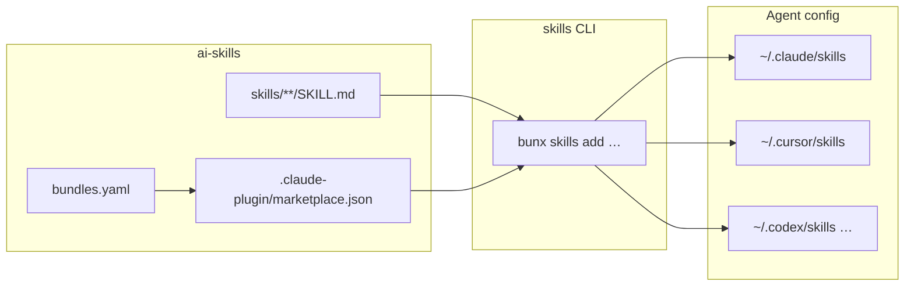

# Contributing to ai-skills

Thanks for helping improve this shared **Agent Skills** library.

## Organization-wide expectations

LGTM-HQ’s cross-repo contributor guidance lives in the
**[`.github` repository](https://github.com/lgtm-hq/.github)**. Read it alongside this
document:

- **[Contributing (org)](https://github.com/lgtm-hq/.github/blob/main/CONTRIBUTING.md)**
- **[Code of Conduct](./CODE_OF_CONDUCT.md)**

## What belongs in this repo

- **Skills:** each skill is `skills/<name>/SKILL.md` with YAML frontmatter (`name`,
  `description`, …) following the conventions used by existing skills.
- **Index:** after adding, renaming, or removing skills, **`AGENTS.md` must stay in
  sync**. CI runs `scripts/generate_agents_md.py` / validation; run the same checks
  locally before opening a PR (see below).
- **Installer groups:** assign each skill to a bundle in **`bundles.yaml`** (or list it
  under `ungrouped` for the installer's "Other" bucket). Regenerate
  **`.claude-plugin/marketplace.json`** with `uv run python scripts/generate_marketplace.py`.
- **No secrets:** do not add API keys, tokens, or environment-specific paths in skill
  bodies or examples.

## Local development

```bash
git clone https://github.com/lgtm-hq/ai-skills.git
cd ai-skills
uv sync
uv run lintro fmt
uv run lintro chk
uv run lintro tst
bash scripts/validate.sh
```

Use **`uv`** for Python tooling and **`lintro`** for lint/format/check — do not bypass
with raw **ruff**, **black**, etc.

When you add or move skills, also run:

```bash
uv run python scripts/generate_agents_md.py
uv run python scripts/generate_marketplace.py
bash scripts/validate.sh
```

## Pull requests

- Use **[Conventional Commits](https://www.conventionalcommits.org/)** in PR titles;
  this repository uses **squash merge**, and the merge title may drive automated
  **semver** releases.
- Follow **`.github/PULL_REQUEST_TEMPLATE.md`** when you open a PR.
- Expect CI to run **lintro** (via the published **py-lintro** container image) and
  **`bash scripts/validate.sh`**.

## Review mindset

Skills are consumed by multiple agents; prefer **clear descriptions**, stable naming,
and **minimal required context** in each `SKILL.md`.

## Architecture



The [Vercel Labs `skills` CLI](https://github.com/vercel-labs/skills) reads
`marketplace.json` to render the grouped checkbox installer. Skill paths stay flat
(`skills/<name>/`); bundles are metadata only. Multi-agent install (`-a cursor`,
`--all`, symlinks into each agent's config directory) is unchanged.

## CI and releases

Pull requests and pushes to `main` run **lintro** (via the published **py-lintro**
container image) and `bash scripts/validate.sh`.

Version bumps and **CHANGELOG.md** updates flow through **`lgtm-hq/lgtm-ci`**
[reusable workflows](https://github.com/lgtm-hq/lgtm-ci), called from this repo
with **full SHA pins** on `uses:` (see `.github/workflows/release-version-pr.yml`
and `release-auto-tag.yml`).

**Baseline note:** [`lgtm-ci#138`](https://github.com/lgtm-hq/lgtm-ci/pull/138)
is merged; the current caller pins match `lgtm-hq/lgtm-ci` **`main`** at
`79444626c1b3afa4d959b5840b4b5310a46a4095` (re-verify when bumping).
