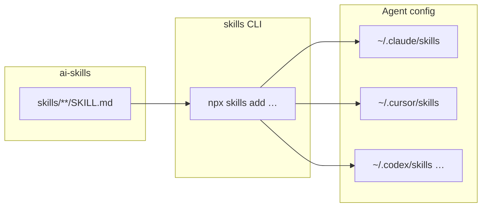

# ai-skills

<!-- markdownlint-disable MD033 MD013 -- badges and centered intro -->
<p align="center">
Canonical <a href="https://agentskills.io">Agent Skills</a> library — one <code>skills/</code> tree for Claude Code, Cursor, Codex, and other agents.
</p>

<p align="center">
<a href="LICENSE"></a>
<a href="https://github.com/lgtm-hq/ai-skills/actions/workflows/ci.yml?query=branch%3Amain"></a>
<a href="https://github.com/lgtm-hq/ai-skills/releases/latest"></a>
</p>

<!-- markdownlint-enable MD033 MD013 -->

This repository is the **source of truth** for shared skills: each skill lives at
`skills/<name>/SKILL.md` with YAML frontmatter (`name`, `description`). There is
**no** per-agent copy of the catalog in-repo; installers symlink into each
agent’s config directory.

## Install (recommended)

Use the [Vercel Labs `skills` CLI](https://github.com/vercel-labs/skills) to
install into detected agents:

```bash
# Latest from default branch
npx skills add lgtm-hq/ai-skills -g --all

# Pinned to a release tag (example)
npx skills add lgtm-hq/ai-skills@v0.1.0 -g --all

# Single agent (e.g. Cursor)
npx skills add lgtm-hq/ai-skills -a cursor -g
```

Update later with `npx skills update lgtm-hq/ai-skills` (see upstream CLI docs).

## Skill inventory

See **[AGENTS.md](./AGENTS.md)** for the full list (**30** skills) with short
descriptions and paths. Regenerate that index after skill changes (see
`scripts/generate_agents_md.py` in CI).

## Repository layout

```text
skills/<name>/SKILL.md   # Canonical skill definitions (this is the product)
AGENTS.md                # Human- and agent-readable index
scripts/validate.sh       # Frontmatter, naming, AGENTS sync checks
tests/                    # Pytest wraps for validate script
.github/workflows/      # CI + thin callers into org reusable workflows
```

## Architecture



## Contributing (clone + check)

For changes to skills, scripts, or tests:

```bash
git clone https://github.com/lgtm-hq/ai-skills.git
cd ai-skills
uv sync
uv run lintro fmt
uv run lintro chk
uv run lintro tst
```

Use [Conventional Commits](https://www.conventionalcommits.org/) for PR titles
(squash merge drives release semver). Follow
`.github/PULL_REQUEST_TEMPLATE.md`.

### CI

Pull requests and pushes to `main` run **lintro** (via the published
**py-lintro** container image) and `bash scripts/validate.sh`.

### Releases

Version bumps and **CHANGELOG.md** updates flow through **`lgtm-hq/lgtm-ci`**
[reusable workflows](https://github.com/lgtm-hq/lgtm-ci), called from this repo
with **full SHA pins** on `uses:` (see `.github/workflows/release-version-pr.yml`
and `release-auto-tag.yml`). When upstream release behavior changes, bump those
SHAs to a commit that exists on GitHub (`repos/lgtm-hq/lgtm-ci/commits/<sha>`).

**Baseline note:** [`lgtm-ci#138`](https://github.com/lgtm-hq/lgtm-ci/pull/138)
is merged; the current caller pins match `lgtm-hq/lgtm-ci` **`main`** at
`7a841708a04853ff21c9874a556ce279d1668f5a` (re-verify when bumping).

## License

MIT — see [LICENSE](./LICENSE).
